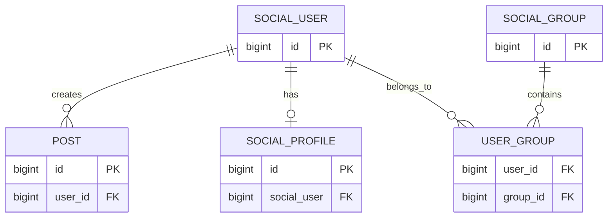

# DB設計分析

## 1. 概要

このプロジェクトは Spring Data JPA と H2 を使用しており、`models` 配下の4つのエンティティからDBテーブルを自動生成する設計です。

`src/main/resources/application.properties` では、インメモリH2データベースが設定されています。

```properties
spring.datasource.url=jdbc:h2:mem:test
```

そのため、アプリケーションを停止するとデータは基本的に消えます。

## 2. テーブル構成

### 2.1 `SocialUser` テーブル

対応クラス: `src/main/java/com/social/media/models/SocialUser.java`

| カラム | 内容 |
|---|---|
| `id` | 主キー。DB側で自動採番 |

`SocialUser` は以下のリレーションを持ちます。

- `SocialProfile` と1対1
- `Post` と1対多
- `SocialGroup` と多対多

グループとの多対多リレーションでは、`SocialUser` が所有側です。

### 2.2 `Post` テーブル

対応クラス: `src/main/java/com/social/media/models/Post.java`

| カラム | 内容 |
|---|---|
| `id` | 主キー。自動採番 |
| `user_id` | `SocialUser.id` を参照する外部キー |

定義は次のとおりです。

```java
@ManyToOne
@JoinColumn(name = "user_id")
private SocialUser socialUser;
```

これは、複数の投稿が1人のユーザーに属することを表します。

```text
SocialUser 1 ---- N Post
```

`SocialUser` 側では、次のように逆方向の関連を定義しています。

```java
@OneToMany(mappedBy = "socialUser")
private List<Post> posts = new ArrayList<>();
```

`mappedBy = "socialUser"` によって、外部キーを管理するのは `Post` 側であることを示しています。

現在の `Post` クラスには `content`、`title`、`createdAt` などの投稿内容・日時のカラムはありません。現状では、ユーザーに紐づく空の投稿レコードに近い設計です。

### 2.3 `SocialProfile` テーブル

対応クラス: `src/main/java/com/social/media/models/SocialProfile.java`

| カラム | 内容 |
|---|---|
| `id` | 主キー。自動採番 |
| `social_user` | `SocialUser.id` を参照する外部キー |

定義は次のとおりです。

```java
@OneToOne
@JoinColumn(name = "social_user")
private SocialUser user;
```

`SocialProfile` 側に外部キー `social_user` を持つため、プロフィール側がリレーションの所有側です。

`SocialUser` 側は次の定義です。

```java
@OneToOne(mappedBy = "user")
private SocialProfile socialProfile;
```

したがって、設計上は次の1対1関係です。

```text
SocialUser 1 ---- 1 SocialProfile
```

プロフィールテーブルの `social_user` には、ユーザーIDが格納されます。

ただし、DB上で必ず1ユーザー1プロフィールを保証したい場合は、`social_user` にユニーク制約が存在することを確認する必要があります。

### 2.4 `SocialGroup` テーブル

対応クラス: `src/main/java/com/social/media/models/SocialGroup.java`

| カラム | 内容 |
|---|---|
| `id` | 主キー。自動採番 |

ユーザーとの多対多リレーションを持ちます。

```java
@ManyToMany(mappedBy = "groups")
private Set<SocialUser> socialUsers;
```

`mappedBy = "groups"` により、関連付けを実際に管理するのは `SocialUser.groups` であることを示しています。

### 2.5 `user_group` 中間テーブル

多対多リレーションのため、JPAによって `user_group` テーブルが作成されます。

```java
@JoinTable(
    name = "user_group",
    joinColumns = @JoinColumn(name = "user_id"),
    inverseJoinColumns = @JoinColumn(name = "group_id")
)
```

想定される構造は次のとおりです。

| カラム | 参照先 |
|---|---|
| `user_id` | `SocialUser.id` |
| `group_id` | `SocialGroup.id` |

リレーションは次の形です。

```text
SocialUser N ---- N SocialGroup
```

`Set` を使用しているため、同じユーザーとグループの組み合わせを重複登録しない意図が表現されています。ただし、DB側でも重複を確実に防ぐには、`user_id` と `group_id` の複合ユニーク制約を設定するのが望ましいです。

## 3. ER図



## 4. リレーションの所有側

| 関係 | 所有側 | 外部キー・管理情報 |
|---|---|---|
| User - Post | `Post` | `post.user_id` |
| User - Profile | `SocialProfile` | `social_profile.social_user` |
| User - Group | `SocialUser` | `user_group.user_id`, `user_group.group_id` |

両方向にフィールドがあっても、DB更新を管理する側は決まっています。例えばグループ関係では、`SocialGroup.socialUsers` に追加するだけではDBの中間テーブルが更新されない可能性があります。実際の関連付けは、所有側である `SocialUser.groups` に設定する必要があります。

## 5. 初期データ

`DataInitializer` では、次の関連付けが登録されます。

```text
user1 -> group1
user2 -> group1
user2 -> group2
user3 -> group2
```

`user_group` には概念的に次の行が入ります。

| `user_id` | `group_id` |
|---:|---:|
| 1 | 1 |
| 2 | 1 |
| 2 | 2 |
| 3 | 2 |

さらに、3人のユーザー、3件の投稿、3件のプロフィールが作成されます。

## 6. リポジトリ構成

各エンティティには対応するSpring Data JPAリポジトリがあります。

- `SocialUserRepository`
- `SocialProfileRepository`
- `SocialGroupRepository`
- `PostRepository`

すべて `JpaRepository<Entity, Long>` を継承しているため、標準的なCRUD操作が利用できます。

- 全件取得
- ID検索
- 登録
- 更新
- 削除

現在、カスタム検索条件やJOINクエリは定義されていません。

## 7. 設計上の特徴と注意点

### 良い点

- 主キーは全エンティティで統一して自動採番される
- 多対多関係を中間テーブルで正しく表現している
- JPAの所有側と逆側が明確に分けられている
- H2を使っているため、開発・検証を始めやすい
- `@JsonIgnore` により、JSONレスポンスで関連エンティティが無限再帰する問題を抑制している

### 改善余地

1. **各テーブルに業務データが少ない**

   現在はほぼIDと関連情報だけです。実用化する場合は、以下のようなカラムが必要になる可能性があります。

   - ユーザー: `username`, `email`, `created_at`
   - プロフィール: `display_name`, `bio`, `avatar_url`
   - グループ: `name`, `description`
   - 投稿: `content`, `created_at`, `updated_at`

2. **外部キーのNULL許可が明示されていない**

   `Post.user_id` や `SocialProfile.social_user` が必須なら、`optional = false` や `nullable = false` を指定してDB制約として意図を明確にする方がよいです。

3. **削除時の動作が未定義**

   `cascade` や `orphanRemoval` が設定されていません。ユーザー削除時に投稿・プロフィールをどう扱うかを定義する必要があります。

4. **テーブル名・カラム名を明示した方が保守しやすい**

   現在はJPAの命名規則に依存しています。`@Table` や `@Column` を使用して、テーブル名・カラム名を明示するとDB設計書との対応が分かりやすくなります。

5. **H2のインメモリDBなので永続化されない**

   現在の設定ではアプリケーション再起動時にデータが消えます。本番利用ではPostgreSQLやMySQLなどの永続DBへの切り替えが必要です。

6. **エンティティに `@Data` を使用している**

   Lombokの `@Data` は `equals`、`hashCode`、`toString` も自動生成します。エンティティ間に相互参照があるため、関連エンティティを含む比較や文字列化で、無限再帰や予期しない動作が起きる可能性があります。エンティティでは必要なメソッドを個別に定義する方が安全です。

## 8. まとめ

このプロジェクトのDB設計は、次の4テーブルと1中間テーブルを中心としたソーシャルサービスの基本構造です。

```text
social_user
social_profile
post
social_group
user_group
```

関係は以下のとおりです。

```text
ユーザー 1 --- N 投稿
ユーザー 1 --- 1 プロフィール
ユーザー N --- N グループ
```

JPAの関連付け自体は基本的に正しく構成されています。ただし、現時点では学習用・リレーション確認用の最小モデルに近く、投稿内容やユーザー名などの業務カラム、必須制約、削除ルール、永続DBへの移行設計はこれから追加する段階です。
